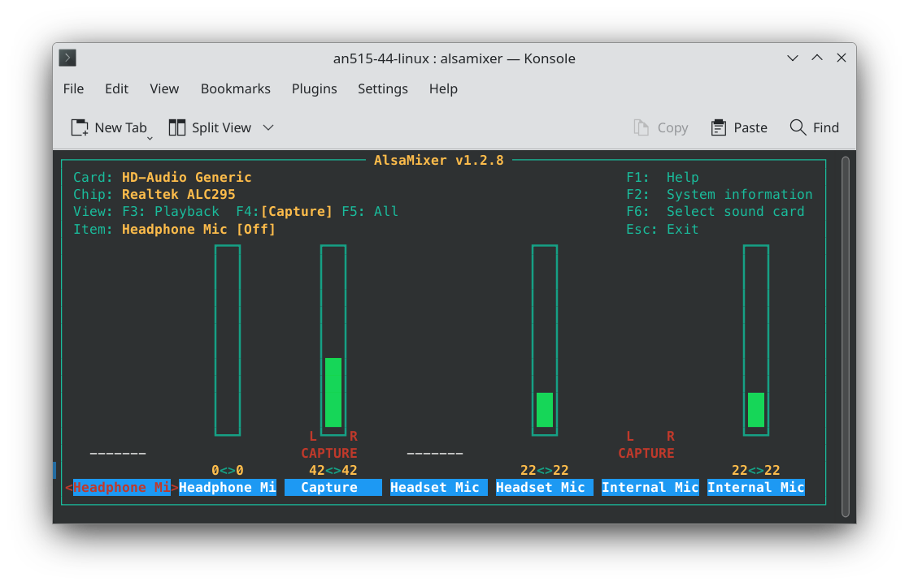
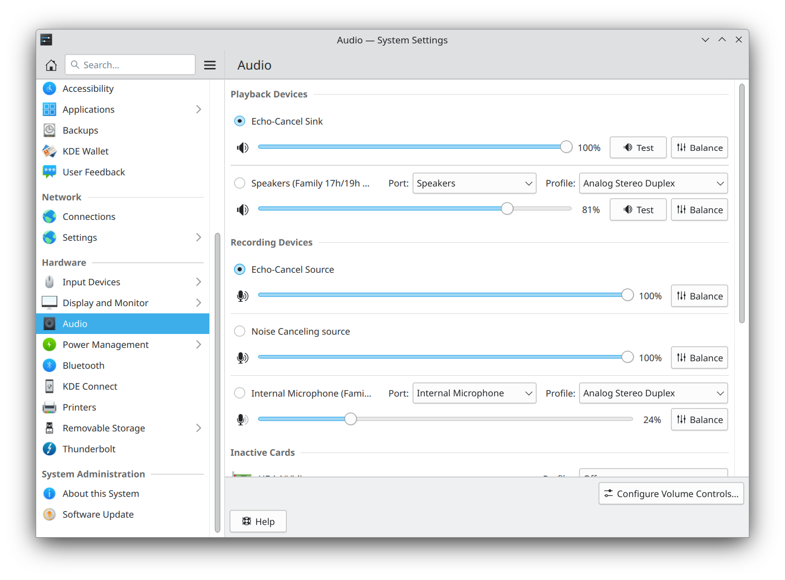

# Acer Nitro 5 AN515-44 Linux Fixes

This project is dedicated to providing fixes and optimizations for the Acer Nitro 5 AN515-44 laptop running Linux. It addresses various issues related to audio, microphone settings, CPU performance, HDMI functionality, and power-saving. Additionally, this guide assumes you are using the "noise-suppression-for-voice" Git project for audio noise suppression and the "auto-cpufreq" project for CPU optimization.

## Audio Fixes

To improve audio quality and enable noise suppression on your Acer Nitro 5 AN515-44 laptop running Linux, follow these steps:

1. **Install noise-suppression-for-voice**: You can find the "noise-suppression-for-voice" Git project [here](https://github.com/werman/noise-suppression-for-voice). Download the latest release and place it under `$HOME/Tools`.

2. **Microphone Settings**: Adjust your microphone settings using ALSA Mixer.
   

   - **Note**: You should configure these settings every time you log in, as they may reset.

3. **Effects Configuration**: Copy the `.config` folder from the "Audio-Fixes" directory to your `$HOME` directory and restart Pipewire by running:

   ```bash
   systemctl --user restart pipewire.service
   ```

   Then, select "Echo-Cancel Sink" for the speaker and "Echo-Cancel Source" for the microphone.
   

   - The configuration should be read automatically on login, eliminating the need to restart Pipewire every time.

4. **Headset Microphone**: Copy the `etc` folder from the "Audio-Fixes" directory to your `/` directory. This sets a model for snd_hda_intel module.

## CPU Optimization

For optimizing CPU performance on the Acer Nitro 5 AN515-44 laptop, I use the "auto-cpufreq" utility. This tool manages CPU frequency and power states to enhance performance and power efficiency.

1. **Install auto-cpufreq**: You can find the "auto-cpufreq" project [here](https://github.com/AdnanHodzic/auto-cpufreq). Follow the installation instructions provided in the project's README.

2. **Usage**: Once installed, it should start and work automatically. You can check its status and statistics by running:

   ```bash
   auto-cpufreq --stats
   ```

## HDMI Fixes

If you encounter any issues related to HDMI connectivity on your laptop, copy the folder from "HDMI-Fixes" to the root directory (`/`) and add the following to your kernel command line:

   ```bash
   rd.driver.blacklist=nouveau modprobe.blacklist=nouveau nvidia-drm.modeset=1
   ```

You also need to start a few services to make sure everything works fine (This also enables wayland support for nvidia):

   ```bash
   sudo systemctl enable nvidia-{suspend,resume,hibernate,persistenced}
   ```

## Power Saving

To save additional power on your laptop, you can apply the following settings:

1. NMI (Non-Maskable Interrupt) watchdog is a feature that periodically checks the system's responsiveness. Disabling it can help save power. To disable add this to kernel command line:

   ```bash
   nmi_watchdog=0
   ```

2. Copy the folder from "Wifi-Fixes" to enable power-saving for the Wi-Fi card.

Please note that this project is meant to provide guidance and solutions for common issues faced by Acer Nitro 5 AN515-44 laptop users running Linux. It's important to back up your data and exercise caution when making system changes.

Feel free to contribute to this project by submitting pull requests with additional fixes or improvements to benefit the Acer Nitro 5 AN515-44 Linux community.